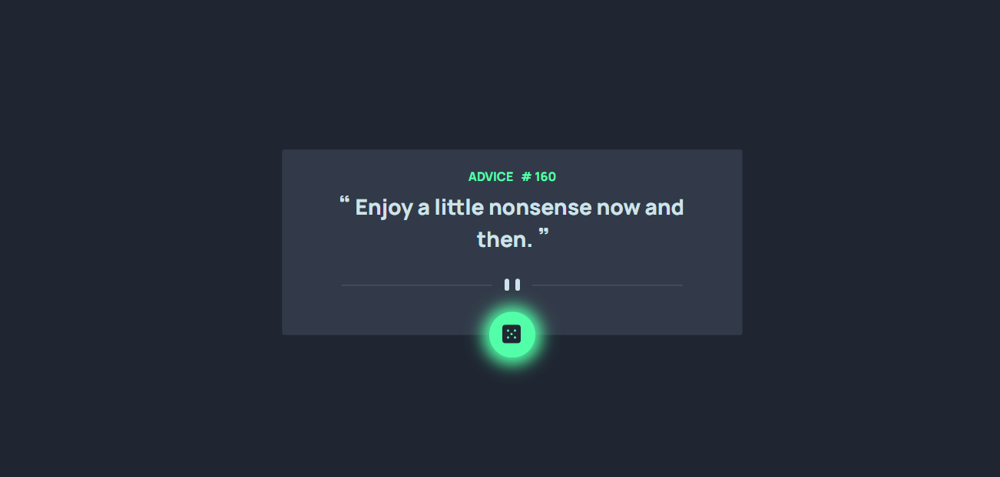

# HTML_CSS_JS_API_frontend-mentor_junior_Advice-generator-app

this is an API learning project ,trying to prictice API "GET" method like to (get a random advice with it's id ) , it contains html,css,Bootstrap and Js file.
 
## Table of contents

- [Overview](#overview)
- [Installation](#Installation)
- [Links](#Links)
- [Screenshot](#Screenshot)
- [What I learned](#what-i-learned)
- [helpful links](#helpful-links)
- [Continued development](#continued-development)
- [Author](#author)
- [Acknowledgments](#Acknowledgments)


## overview
this is an API learning project ,trying to prictice API "GET" method like to (get a random advice with it's id ) , it contains html,css,Bootstrap and Js file.

## Installation
To get started with this project, follow these steps:

you can clone the project or download it as Zip file.
 Clone the repository:
   ```bash
   git clone https://github.com/olahasan/HTML_CSS_JS_API_frontend-mentor_junior_Advice-generator-app.git
```

## Links

If you want to open the link in a new tab, you can:

- Press **Ctrl** (or **Cmd** on Mac) while clicking the link.
- Right-click the link and select **Open link in new tab**.

Otherwise, all links will open in the same tab.

- Solution URL: [here](https://github.com/olahasan/HTML_CSS_JS_API_frontend-mentor_junior_Advice-generator-app)

- Live Site URL: [here](https://olahasan.github.io/HTML_CSS_JS_API_frontend-mentor_junior_Advice-generator-app/)


 ## Screenshot
 



## what-i-learned
Through this project:
- how to deal with **postman** 
- how to deal with **Axios(cdn)**
- how to deal with **fontawesome**
- how to deal with **Normalize.css** 
- practice Bootstrap and CSS with js
- how to get All data.
- how to collect between html, css, js, API, and Bootstrap.
- how to push it on github + gh-pages

## helpful-links
- **API** : (https://api.adviceslip.com/)
- **fontawesome** : (https://fontawesome.com/)
- **Bootstrap** : (https://getbootstrap.com/)
- **Axios** : (https://axios-http.com/docs/intro)
- **Normalize** : (https://necolas.github.io/normalize.css/)
- **google-fonts** : (https://fonts.google.com/selection/embed)
- **challenge** : (https://www.frontendmentor.io/challenges/advice-generator-app-QdUG-13db)

## Continued Development
In the future, I plan to:
- do the same project using JS framework like react.

### Author

GitHub - @olahasan
**[olahasan](https://github.com/olahasan)**

### Acknowledgments

I would like to thank the **[frontendmentor](https://www.frontendmentor.io/challenges)** for providing this challenge.

